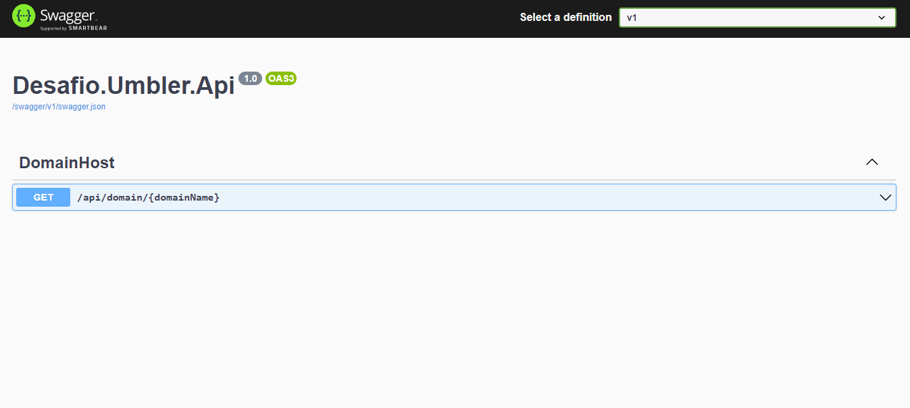
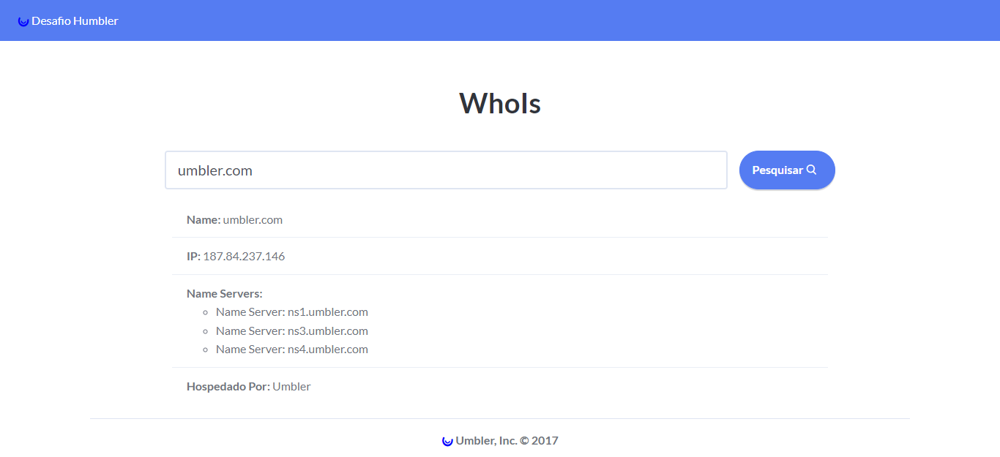

# Desafio Umbler

Esta é uma aplicação web que recebe um domínio e mostra suas informações de DNS.

# Modificações Realizadas:

## 📌 **BackEnd**

- Criei uma arquitetura em camadas para separar as responsabilidades.

- Alterei o nome da entidade `Domain` para `DomainHost` pois havia conflito de namespace com o projeto `Domain`, e como consequência, tornei o nome da entidade mais explicito.

- Criei o mapeamento para a `DomainHost`, utilizando Code First e Fluent API.

- Movi a lógica do código da `DomainHostController` para a `Application`, deixando-a mais limpa (2 linhas apenas), e consequentemente, diminuindo as responsabilidades da API.

- Para comunicar a `API` com a `Application`, criei uma interface para que a `Controller` não dependa da `Application` diretamente.

- Criei a `BaseController` para tratar o response de cada chamada HTTP com seu respectivo `ResultType`, `Data`, ou `Message`.

- Refatorei a `Application`, criando métodos para encapsular o código duplicado, e testei possíveis retornos para evitar erros.

- Refatorei o `Domínio`, encapsulando e validando as propriedades, deixando o domínio mais rico.

- Adicionei o Swagger UI na API, o que nos auxilia no consumo e visualização da API REST.

- Desacoplei o `LookupClient` e o `WhoisClient` da `Application`, tornando o código mais fácil de manter e testar.

- Criei um método que extrai do Whois os ServerNames utilizando `Regex`.

- Habilitei os analizadores de código do `.NET` para melhorar a qualidade do código.

## 📌 **FrontEnd**

- Criei o projeto SPA para o FrontEnd utilizando o framework `Blazor`.

- Utilizei `DataAnnotations` para validar o Input.

- Criei um spinner para o loading inicial.

- Adicionei validação no DomainName utilizando `Regex`, impedindo que um nome de domínio sem extensão seja enviado para a API.

- Tornei a SPA responsiva para mobile

## 📌 **Teste**

- Criei os testes unitários para a entidade `DomainHost`.

- Ampliei os testes unitários da `DomainHostController` para testar todos os fluxos possíveis, e para isso, criei um `mock` para ambos `LookupClient` e `WhoisClient`.

**API**

**FrontEnd**

